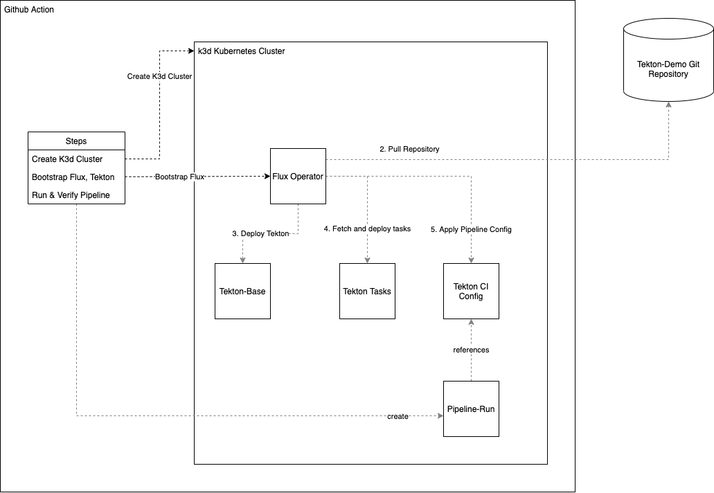

# Tekton CI Demo

This Demo repository will deploy and configure a Tekton CI System. The Project will automatically bootstrap a K3d cluster with Flux.



## CI of the Tekton CI

This repository uses GitHub Actions to validate the Tekton config. Every commit triggers a cluster creation and validation.
The up-to-date bootstrap process is documented in the GitHub Actions workflow you can find in [this repo](./.github/workflows/create-cluster.yml).

## Cluster Bootstrap

On a high level you need to provide a Github token with the following scopes: `repo_status`, `public_repo`. You can find the management dialog [here](https://github.com/settings/tokens). This token is used by the flux operator to connect to the git repository and roll-out the desired cluster state based on this repository.
 

1. Bootstrap of the cluster and the Tekton services and config

```sh
k3d cluster create --registry-use k3d-registry.localhost:5000
```

 ```sh
   GITHUB_TOKEN=<token> GITHUB_USER=<username> flux bootstrap github \
   --owner=<username-of-the-repo-owner> \
   --repository=tekton-demo \
   --private=false \
   --personal=true \
   --branch=main \
   --path=clusters/local
 ```
   
2. Check the progress of the deployment

```shell
kubectl get Kustomization -n flux-system -w
```

3. (optional) Connect to the Tekton Dashboard

The Dashboard is deployed and accessible via the `tekton-dashboard` service on port 9097.

```shell
kubectl --namespace tekton-pipelines port-forward svc/tekton-dashboard 9097:9097
```

## Using the Tekton sample pipeline

You can inspect the deployed tasks and pipelines by issuing those commands. Before following along make sure to install the [CLI tools](https://tekton.dev/docs/getting-started/#set-up-the-cli).

```shell
tkn task list
tkn pipeline list
```

Create a pipeline run as follows and issue it via `kubectl create -f hello-goodbye-pipeline-run.yaml`. This command will return the created pipelinerun which you need for reference later. E.g. enter `tkn pr logs $PIPELINE_RUN_NAME` to get the log output of the pipeline.
